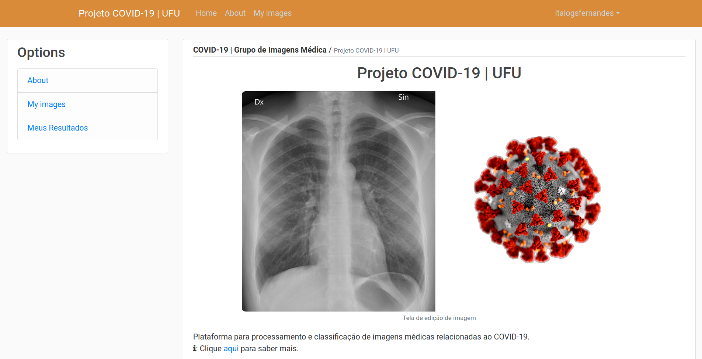

# Projeto - COVID-UFU - Grupo de Imagens médicas
>Open-source initiative for a system for medical image processing.

## Online Version (Under Development)
Follow the link: [Covid-UFU WebApp](http://covid-ufu.walbax.com.br/)

## Contribute
If you want to contribute to the project, all help is welcome. Contributing is also a way to learn more about [*social coding*](http://opentechschool.github.io/social-coding/), bug reports, development tips, *pull requests*...

### WebApp - Setup
* [Python3](https://www.python.org/downloads/) with the following modules installed:
`pip install -r requirements.txt`
* See file: [aws_educate.md](aws_educate/aws_educate.md)

## More Info
* [An image-processing based automated bacteria colony counter](http://ieeexplore.ieee.org/document/5291926/).
* [Nondestructive technique for bacterial count based on image processing](http://www.oatext.com/Nondestructive-technique-for-bacterial-count-based-on-image-processing.php).
* [Image manipulation and processing using Numpy and Scipy](http://www.scipy-lectures.org/advanced/image_processing/index.html).
* [MIT Course: Biomedical Signal and Image Processing](https://ocw.mit.edu/courses/health-sciences-and-technology/hst-582j-biomedical-signal-and-image-processing-spring-2007/index.htm)

## License
This project is licensed under the MIT License - see the [LICENSE.md](LICENSE.md) file for details.

## Autores
* **Italo Fernandes** - https://github.com/italogfernandes - italogsfernandes@gmail.com
* **Paulo Camargo Silva** - https://github.com/paulocamargos
* **Pedro Sousa**

See also the list of [contributors](https://github.com/italogsfernandes/imagens-medicas-2/contributors) who participated in this project.
