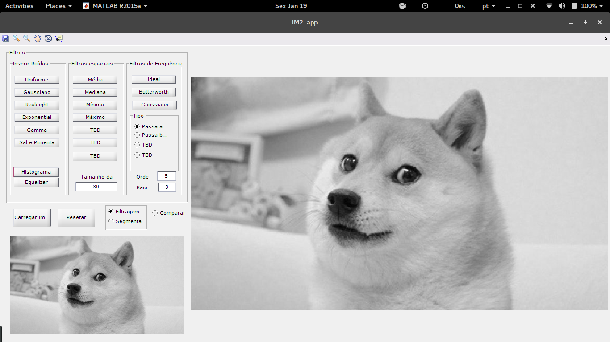
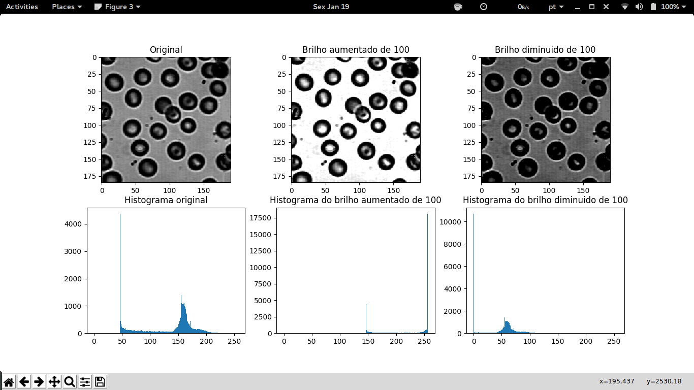
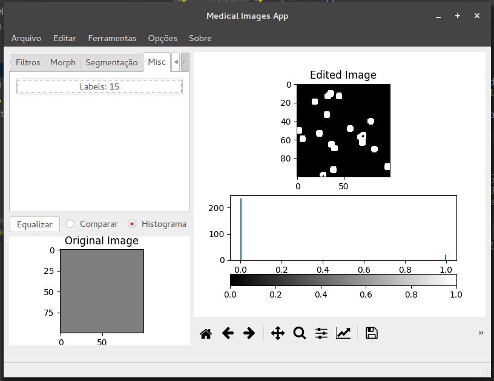
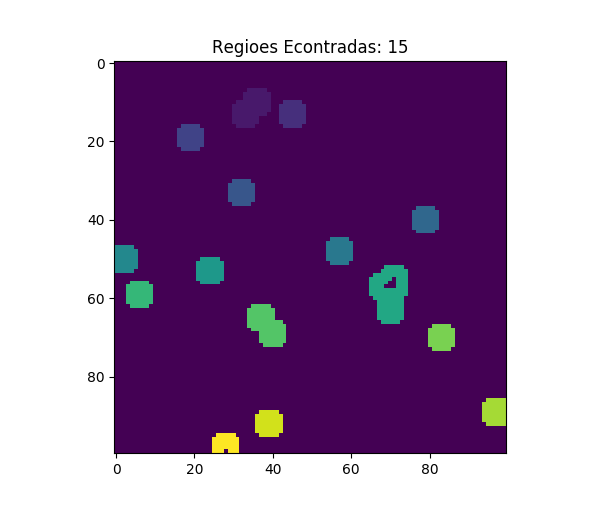

# Imagens Médicas 2
>Iniciativa open-source de um sistema para processamento de imagens médicas.

O projeto [IM2_app](https://github.com/ronaldosena/imagens-medicas-2) é uma iniciativa para criar um sistema open-source  de processamento de imagens médicas.

**Obs**: O app IM2_app foi desenvolvido em MATLAB, isso gera contradições quanto a iniciativa open-source, entretanto o programa deve rodar com todas suas funcionalidades em Octave.
Existe uma linha de desenvolvido em python, cujo app possui quase todas as funcionalidades da versão em matlab,  e ainda algumas a mais (Ex: contar a quantidade de colônias).

## Instalação
IM2_app está em sua versão 1.1.0. Baixe o instalador [__*aqui*__](https://goo.gl/59uwRe).
A versão em python ainda não possui instalador, para fazer o seu uso, rode o aplicativo diretamente com o python.
``python im2_app.py``

## Colabore com o projeto

Se você quiser contribuir com o projeto, toda ajuda será bem-vinda. Contribuir também é uma forma de aprender mais sobre [*social coding*](http://opentechschool.github.io/social-coding/), relatório de bugs, sugestões de desenvolvimento, *pull requests*...

## Neste Repositório
- Docs: Imagens, guias, referencias, codigos consultados.
- **Apps**: Códigos da Interface.
    - **Apps/mIM2_app**: GUI feita em matlab.
    - **Apps/pyIM2_app**: GUI feita em python.
- Aulas: Aulas e trabalhos práticos da disciplina. Códigos em python e matlab.
- datasets: Imagens utilizadas nas aulas e algumas imagens de exemplo para testes do app.
- **toolbox**:
    - **matlab**: background do processamento de imagens do IM2_app.
    - **python**: ferramentas para processamento de imagens com python utilizando diferentes bibliotecas (scipy, ski-image e open-cv) a escolha do usuário.

## Configurando o ambiente de desenvolvimento
* [Libraries](https://github.com/italogfernandes/libraries) - Se em algum momento for mencionada alguma biblioteca customizada e você nao encontrar, ela pode estar neste repositorio. Nele estão diversas ferramentas que criei ao longo do desenvolvimento de diversos projetos.
* [Python3](https://www.python.org/downloads/) with the following modules installed:
    * [Matplotlib](https://pypi.python.org/pypi/matplotlib): ``pip install matplotlib``
    * [PyQt5](https://pypi.python.org/pypi/PyQt5): ``pip install pyqt5``
    * [Scipy](https://pypi.python.org/pypi/scipy): ``pip install scipy``
    * [ImageIO](https://pypi.python.org/pypi/imageio): ``pip install imageio``
    * [SciKit-Image](https://pypi.python.org/pypi/scikit-image): ``pip install skimage``
* [Matlab](https://www.mathworks.com/pricing-licensing.html?prodcode=ML&intendeduse=student) ou [Octave](https://www.gnu.org/software/octave/) (Open-Source Alternative).

## More Info
* [An image-processing based automated bacteria colony counter](http://ieeexplore.ieee.org/document/5291926/).
* [Nondestructive technique for bacterial count based on image processing](http://www.oatext.com/Nondestructive-technique-for-bacterial-count-based-on-image-processing.php).
* [Image manipulation and processing using Numpy and Scipy](http://www.scipy-lectures.org/advanced/image_processing/index.html).
* [MIT Course: Biomedical Signal and Image Processing](https://ocw.mit.edu/courses/health-sciences-and-technology/hst-582j-biomedical-signal-and-image-processing-spring-2007/index.htm)

## License

This project is licensed under the MIT License - see the [LICENSE.md](LICENSE.md) file for details

## Autores

* **Ronaldo Sena** - https://github.com/ronaldosena - ronaldo.sena@outlook.com
* **Italo Fernandes** - https://github.com/italogfernandes - italogsfernandes@gmail.com

See also the list of [contributors](https://github.com/ronaldosena/imagens-medicas-2/contributors) who participated in this project.
