# Medical Images WebApp
>Open-source initiative for a system for medical image processing.

## Setup Amazon Web Services (AWS)
### AWS Educate Account
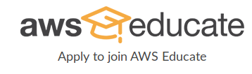
1. Go to: https://aws.amazon.com/education/awseducate/
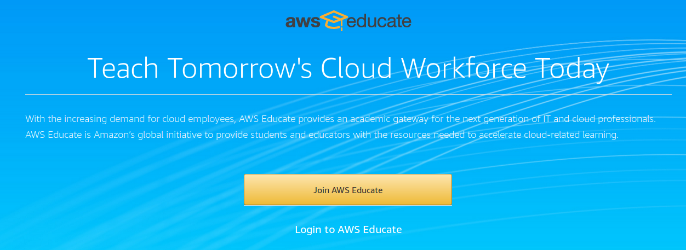
2. Select: "Join AWS Educate"
3. Select: "Student"
4. Add your informations:
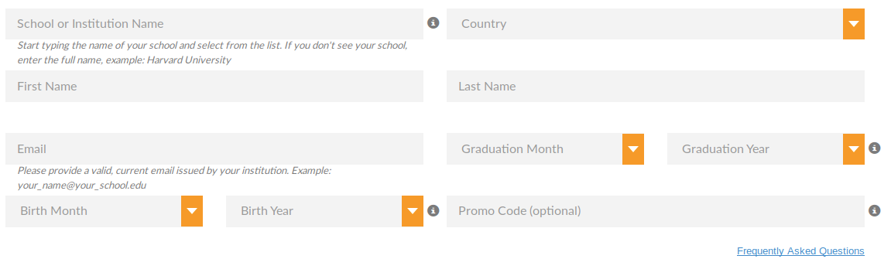
5. Verify your institutional email.

### AWS Account
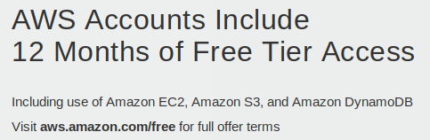
1. Go to: https://aws.amazon.com, then select *Sign Up*.
2. Fill the form:
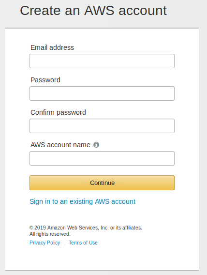
3. Add your contact information.
4. Unfortunatelly, it demands a valid credit/debit card.
> Please type your payment information so we can verify your identity. We will not charge you unless your usage exceeds the AWS Free Tier Limits. Review frequently asked questions for more information.

5. Confirm your Identity with a sms code.
6. Select a support plan, for this project I've choose the free one.
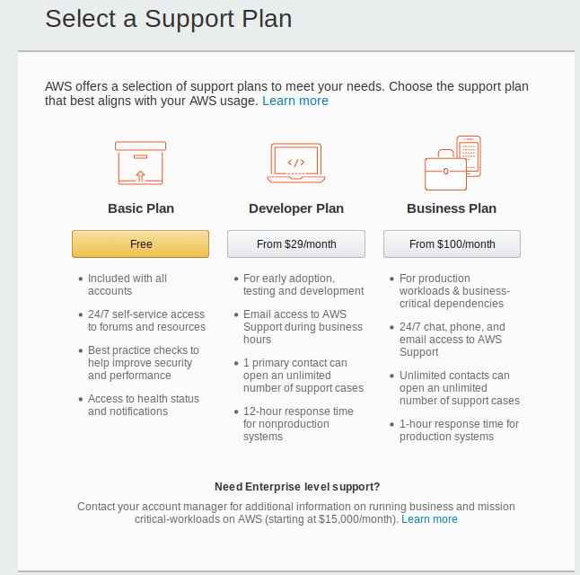
7. **Finally**, you will be redirect to the sign in page.

### AWS Console - EC2 instance
1. Go to your management console: https://aws.amazon.com/console/, depending on the region you are goint to see a different url after login, in my case: https://sa-east-1.console.aws.amazon.com/console/home?region=sa-east-1
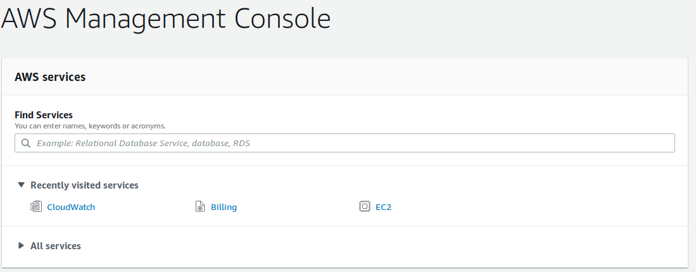
2. Select **EC2**, you will be redirect to a page similar to the next image, then select *Launch Instance*, to create your free EC2 instance.
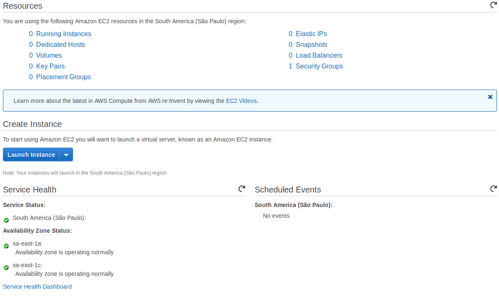
3. Follow the Steps:
    1. **Choose an Amazon Machine Image (AMI)**: Choose one *Free tier eligible* option, in 2019 I am choosing the last Ubuntu LTS server.
    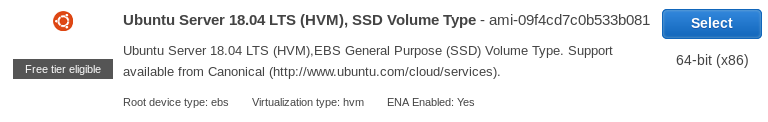
    2. Choose an Instance Type: Choose one *Free tier eligible* option, in my case I have only one Free tier eligible option.
    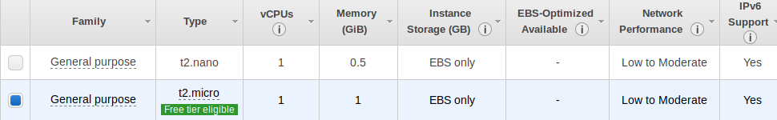
    3. Configure Instance Detail: Let all default options.
    4. Add Storage: You can let the default option, or change the size if you have this for free.
    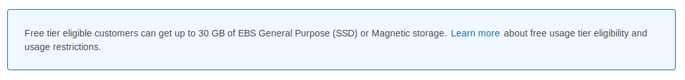
    5. Add Tags: No need to change the default option.
    6. **Configure Security Group**: For security reasons change this option to protect your instance of being acessed from others IPs, if your IP change (you don't have a static IP or you are trying to access your instance by another network), you will need to change this values. For the moment I let this option as the following image, when opening the site to all public I need to change the HTTPS port rules.
    7. Review Instance Launch: Just verify and launch.

Table: Security group options

| Type       | Protocol | Port Range | Source | Description                     |
|------------|----------|------------|--------|---------------------------------|
| SSH        | TCP      | 22         | My IP  | ssh access from my current IP   |
| HTTPS      | TCP      | 443        | My IP  | https access from my current IP |
| HTTP       | TCP      | 80         | My IP  | http access from my current IP  |
| Custom TCP | TCP      | 8000       | My IP  | django debug from my current IP |
| Custom TCP | TCP      | 5000       | My IP  | flask debug from my current IP  |

4. Create your **key pair**, download it and save a **backup** in someplace that you will not lost it.
>  You will not be able to download the file again after it's created.

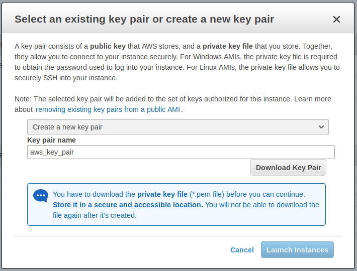

5. Launch your ec2 instance. You will see a message saying ***"Your instances are now launching"*** and some instructions. I highly suggest you to create billing alerts and get notified if you exceed your free usage tier. Then you can go to *View Instances* and see the status of your running instance.

### Connecting to your instance
How to connect to your remote machine using `ssh`.
You can do these configurations after creating a new EC2 instance.
    Obs.: It's important the you have access to your key provided by Amazon in hands

#### Localy (Before first connection)
1. Change the key permission
    ~~~
    $ chmod 400 <yourkey>.pem
    ~~~
1. Add the `.pem` to the local `authorized_keys`
    ~~~
    $ ssh-add <yourkey>.pem
    ~~~
1. Copy the contentes of the `id_rsa.pub`
    ~~~
    $ ssh-keygen -y
    ~~~
    Confirm the file pressing enter and type the password for you `ssh` keys. After that, **copy the output to clipboard.**
1. Connect to the server
    ~~~
    $ ssh ubuntu@xx.xx.xx.xxx
    ~~~
    where `xx.xx.xx.xxx` is you remote IP or DNS

### On server
See file: [setup_server.sh](../../utils/setup_server.sh)
